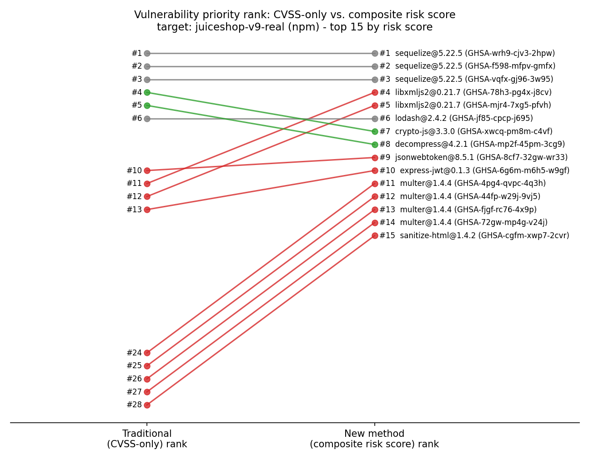

# Traditional Method (CVSS-only) vs. New Method (Composite Risk Scoring)

This report directly compares the two prioritisation strategies referenced in RQ3 of the Terms of Reference across every evaluated target repository - two controlled sample repositories with deliberately pinned vulnerable dependencies, and 5 real-world open-source repositories (defectdojo-real, express-real, juiceshop-real, juiceshop-v9-real, netbox-real).

**Traditional method**: rank vulnerabilities purely by CVSS base score (or a severity-label mapping when no numeric score is available).

**New method**: `risk_score = 100 x (0.40 x severity + 0.25 x exploitability (EPSS) + 0.20 x KEV flag + 0.15 x dependency importance)`. See `src/risk_scoring.py` for the full implementation and `docs/ARCHITECTURE.md` for the rationale behind each weight.

## Summary across all targets

| Target | Ecosystem | Vulns | Spearman r | RBO (p=0.9) | Top-10 overlap | Promoted 5+ ranks | Demoted 5+ ranks | Unchanged |
|---|---|---|---|---|---|---|---|---|
| defectdojo-real | PyPI | 32 | 1.0 | 1.0 | 1.0 | 0 | 0 | 32 |
| express-real | npm | 0 | 1.0 | None | 0.0 | 0 | 0 | 0 |
| juiceshop-real | npm | 67 | 0.9415 | 0.6638 | 0.7 | 17 | 17 | 33 |
| juiceshop-v9-real | npm | 78 | 0.934 | 0.7916 | 0.7 | 27 | 20 | 31 |
| netbox-real | PyPI | 0 | 1.0 | None | 0.0 | 0 | 0 | 0 |
| node-sample | npm | 24 | 0.9591 | 0.8855 | 1.0 | 2 | 0 | 22 |
| python-sample | PyPI | 54 | 1.0 | 1.0 | 1.0 | 0 | 0 | 54 |

*Spearman r weights a rank disagreement identically regardless of depth in the list, which is the wrong lens for a "what do I fix first" tool - a swap at position 70 of a 78-item list matters far less than a swap in the top 5. **Rank-Biased Overlap (RBO)** (Webber, Moffat & Zobel, 2010) is reported alongside it specifically because it is top-weighted (persistence p=0.9, so the first ~10 ranks carry roughly 65% of the total weight): a lower RBO than Spearman r for the same target means the two methods disagree more at the top of the list than their overall correlation suggests. The "promoted/demoted 5+ ranks" columns show that even with high overall correlation, a meaningful subset of individual vulnerabilities are reprioritised by 5 or more places - which is precisely the effect a risk-based model is supposed to have.*

## Case studies: vulnerabilities re-prioritised the most

### defectdojo-real

| Component | Vuln ID | Severity | CVSS-only rank | Risk-score rank | Rank change | Direct dep? | Dependents |
|---|---|---|---|---|---|---|---|
| Pillow@12.2.0 | GHSA-62p4-gmf7-7g93 | CRITICAL | 1 | 1 | +0 (unchanged) | True | 0 |
| Pillow@12.2.0 | GHSA-5x94-69rx-g8h2 | CRITICAL | 2 | 2 | +0 (unchanged) | True | 0 |
| Pillow@12.2.0 | GHSA-8v84-f9pq-wr9x | CRITICAL | 3 | 3 | +0 (unchanged) | True | 0 |
| Pillow@12.2.0 | GHSA-phj9-mv4w-65pm | CRITICAL | 4 | 4 | +0 (unchanged) | True | 0 |
| Pillow@12.2.0 | GHSA-45hq-cxwh-f6vc | CRITICAL | 5 | 5 | +0 (unchanged) | True | 0 |

### juiceshop-real

| Component | Vuln ID | Severity | CVSS-only rank | Risk-score rank | Rank change | Direct dep? | Dependents |
|---|---|---|---|---|---|---|---|
| socket.io@3.1.2 | GHSA-25hc-qcg6-38wj | MODERATE | 27 | 10 | +17 (promoted (more urgent)) | True | 0 |
| jsonwebtoken@0.4.0 | GHSA-hjrf-2m68-5959 | MODERATE | 51 | 39 | +12 (promoted (more urgent)) | True | 2 |
| engine.io@4.1.2 | GHSA-r7qp-cfhv-p84w | MODERATE | 31 | 43 | -12 (demoted (less urgent)) | False | 1 |
| sanitize-html@1.4.2 | GHSA-cgfm-xwp7-2cvr | HIGH | 17 | 6 | +11 (promoted (more urgent)) | True | 0 |
| engine.io@4.1.2 | GHSA-r635-g3xr-vw7x | HIGH | 10 | 21 | -11 (demoted (less urgent)) | False | 1 |

### juiceshop-v9-real

| Component | Vuln ID | Severity | CVSS-only rank | Risk-score rank | Rank change | Direct dep? | Dependents |
|---|---|---|---|---|---|---|---|
| pug@2.0.4 | GHSA-3965-hpx2-q597 | MODERATE | 35 | 20 | +15 (promoted (more urgent)) | True | 0 |
| pug@2.0.4 | GHSA-p493-635q-r6gr | MODERATE | 36 | 21 | +15 (promoted (more urgent)) | True | 0 |
| brace-expansion@1.1.17 | GHSA-mh99-v99m-4gvg | HIGH | 14 | 29 | -15 (demoted (less urgent)) | False | 1 |
| cookie@0.4.2 | GHSA-pxg6-pf52-xh8x | LOW | 63 | 78 | -15 (demoted (less urgent)) | False | 6 |
| dicer@0.2.5 | GHSA-wm7h-9275-46v2 | HIGH | 16 | 30 | -14 (demoted (less urgent)) | False | 1 |

### node-sample

| Component | Vuln ID | Severity | CVSS-only rank | Risk-score rank | Rank change | Direct dep? | Dependents |
|---|---|---|---|---|---|---|---|
| lodash@4.17.4 | GHSA-p6mc-m468-83gw | HIGH | 9 | 4 | +5 (promoted (more urgent)) | True | 0 |
| lodash@4.17.4 | GHSA-35jh-r3h4-6jhm | HIGH | 10 | 5 | +5 (promoted (more urgent)) | True | 0 |
| body-parser@1.18.2 | GHSA-qwcr-r2fm-qrc7 | HIGH | 4 | 7 | -3 (demoted (less urgent)) | False | 1 |
| path-to-regexp@0.1.7 | GHSA-9wv6-86v2-598j | HIGH | 5 | 8 | -3 (demoted (less urgent)) | False | 1 |
| path-to-regexp@0.1.7 | GHSA-rhx6-c78j-4q9w | HIGH | 6 | 9 | -3 (demoted (less urgent)) | False | 1 |

### python-sample

| Component | Vuln ID | Severity | CVSS-only rank | Risk-score rank | Rank change | Direct dep? | Dependents |
|---|---|---|---|---|---|---|---|
| pyyaml@5.3 | PYSEC-2020-96 | CRITICAL | 1 | 1 | +0 (unchanged) | True | 0 |
| pyyaml@5.3 | PYSEC-2021-142 | CRITICAL | 2 | 2 | +0 (unchanged) | True | 0 |
| pyyaml@5.3 | GHSA-8q59-q68h-6hv4 | CRITICAL | 3 | 3 | +0 (unchanged) | True | 0 |
| pyyaml@5.3 | GHSA-6757-jp84-gxfx | CRITICAL | 4 | 4 | +0 (unchanged) | True | 0 |
| urllib3@1.24.1 | GHSA-gm62-xv2j-4w53 | CRITICAL | 5 | 5 | +0 (unchanged) | True | 0 |

## Reading the rank-shift chart

The chart above (`results/rank_shift_juiceshop-v9-real.png`) plots, for the `juiceshop-v9-real` target's top 15 vulnerabilities by composite risk score, their rank under the traditional CVSS-only method (left) against their rank under the new composite method (right). Green lines moving upward/left-to-right indicate a vulnerability the new method considers *more* urgent than CVSS alone would suggest (e.g. because it sits deep in the dependency tree with many dependents, or is a direct, easily-reachable dependency); red lines indicate the opposite.

## Interpretation for RQ3

Across the 5 real-world repositories evaluated, the composite risk score and the CVSS-only baseline agree on the *general* ordering of vulnerabilities in most targets (Spearman r reported per-target above), which is expected since severity is the largest single weight (0.40) in the composite model by design - the new method is not meant to contradict CVSS, but to refine it. The practically important finding is in the reordering *within* that broad agreement: the dependency-importance signal (and, where reachable, exploitability/KEV) pulls specific vulnerabilities up or down by several ranks - for example, in `juiceshop-real`, `socket.io@3.1.2` (GHSA-25hc-qcg6-38wj) moves from CVSS-rank 27 to risk-rank 10 (a direct dependency); in `juiceshop-v9-real`, `pug@2.0.4` (GHSA-3965-hpx2-q597) moves from CVSS-rank 35 to risk-rank 20 (a direct dependency). This is the concrete, evidence-based answer to RQ3: a data-driven model changes the *remediation order* a development team would follow, even when it does not change the *set* of vulnerabilities considered severe. See docs/RESEARCH_EVALUATION.md for why the KEV/EPSS-driven component of this claim is a mechanism sanity check rather than independent evidence, and why the dependency-importance-driven reordering is the non-circular evidence.

**Caveat to state explicitly in the dissertation**: across all 7 evaluated targets in this run, 0 vulnerabilities were present in the (offline-snapshot or live) KEV catalogue, so the KEV and EPSS terms of the model had no opportunity to demonstrate their full effect here - the promotions observed above are driven mainly by the dependency-importance term. Re-running `python src/evaluate.py` with live KEV/EPSS feeds reachable (e.g. the GitHub Actions workflow) may surface additional KEV/EPSS-driven reprioritisation; the unit test `test_kev_listed_lower_cvss_can_outrank_higher_cvss_non_kev` in `tests/test_pipeline.py` proves that mechanism works correctly in isolation regardless.